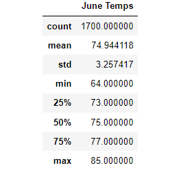
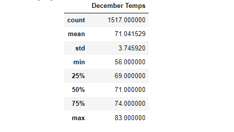

# surfs_up
Advanced Data Storage using SQLite

## Overview 
'Surf & Shake' shop is a new business venture that plan to serve surfboards and icecream to tourists and locals in Hawaii. In order for this busniess plan to take off, investors are being pursued. The investors have to be convinced that the weather is perfect year-round for this surf shop to be a successful investment. 

### Purpose

The purpose of this project is to analyse the weather data for the months of June (summer) and December (winter) to determine temperature trends, in order to convince the investors that a surf and icecream shop will be sustainable year-round in Oahu, Hawaii.

## Results
- The highest temperature for June is 85 whereas for December is 81. This indicates that the weather is pleasently warm throughout the year.

- The lowest temperature recorded in June is 64 whereas that in December is 56. Although the lowest temperature in winter is significantly lower than summer, it is still within the comfortable levels for surfing and icecream. 

- The mean temperature for June is 74.9 while December has a mean temp of 71. Both seasons have pleasant weather which is perfect for surfing.

- There were more observations in June (total of 1700) than December (total of 1517). This would indicate that the June averages would be more accurate than that of December. This is substantiated with the standard deviation of June being less than that of December.

See below for the detailed summary statistics :-

<b> June Statistics </b> :- 

<b> December Statistics </b> :-

## Summary
Comparing the temperature data for June and December, it can be safely said that Oahu will have stable temperatures thorughout the year. Hence a surf and Icecream shop would be sustainable year-round.

Along with the temperature analysis, the rainfall analysis for June and December should be done to see how much rain is likely to fall. If there is a lot of rainfall, the surf shop may not be as successful.

Analysis could also be done for a specific date range or for other months (like March and September) to check the trend of temperature and rainfall patterns for other seasons. This would give a complete weather pattern for all seasons and convince the stakeholders about their decision to invest in the "Surf & Shake" shop.

